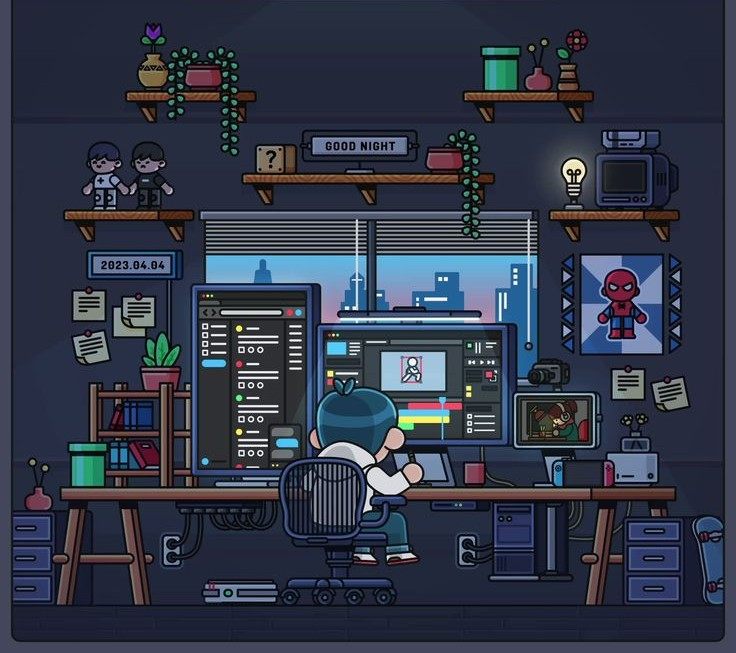

  <h1 align="center">Hi 👋, I am Maharudra aka DuduBoiii</h1>

FY IT Student 
IIT Vishrambagh

 

  
  
  

  

  <b>Information Technology Engineering Student   
Enthusiastic about full-stack development and developing impactful real-world solutions. 
Constantly improving my abilities through active learning and project-based experience.
  

    
### About Me

- 🔭 FY IT Student 
- 🌱 Learning Web Dev
- 🚀 Building projects  
- 👯 Open-source   
- 🥅 Full Stack Developer
- ⚡ Web Techology

### Skills

### Programming Language

### Frontend

### Tools

### Operating System

### Design Tools
   
   
     

### IoT

### LEETCODE

### CODEFORCES

## 📈 GitHub Analytics

<h3>📊 GitHub Stats</h3>

  
  
  
  
  

   

  

  

### Social Media

  
  
  
  
  <a href="https://leetcode.com/u/md2203">
    
 
     <a href="https://www.hackerrank.com/profile/mdudhe2007">
    
 
    

  

